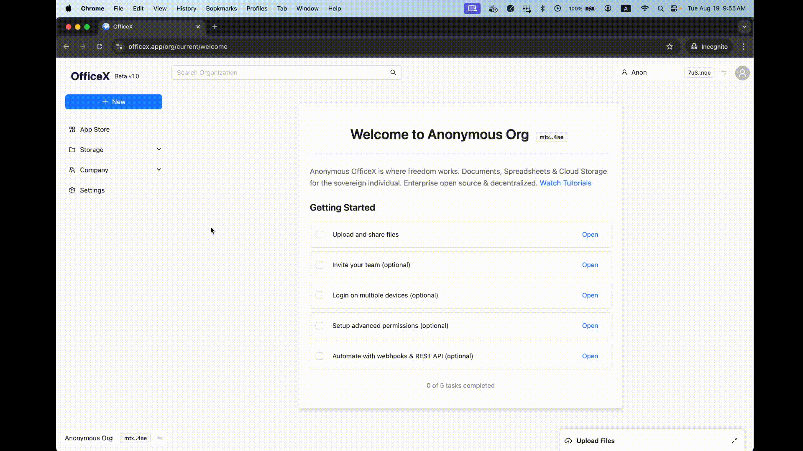

# iFrame Guide

Anonymous OfficeX is designed for whitelabel with zero dependencies. Any developer can add anon workspaces to their app in just 2 mins.

The below `iframe` examples showcase how easy it is to get started. There are two modes:

* `ephemeral offline` mode for purely clientside UX without cloud
* `cloud injected` mode for controlled authentication with cloud

Both modes can use `iframe.postMessage()` commands to control the child iframe from purely clientside. Scroll down to see those commands.



Ephemeral offline mode is a pure clientside iframe with no cloud or backend. Its primary value is for organizational UX. It is ideal for single-use tools such as YouTube Downloaders and PDF generators.&#x20;

The below code snippet is a barebones implementation in raw HTML. It has zero dependencies so you can just copy paste it directly.

<a href="https://codesandbox.io/p/devbox/quickstart-code-forked-tt2495" class="button primary" data-icon="terminal">Run in Codepen</a>

```html
<iframe
  id="officex-iframe"
  src="https://officex.app"
  sandbox="allow-same-origin allow-scripts allow-downloads allow-popups"
></iframe>
<script>
  const iframeElement = document.getElementById("officex-iframe");
  iframeElement.onload = () => {
    iframeElement.contentWindow.postMessage(
      { type: "OFFICEX_INIT", data: { ephemeral: {} }, tracer: "my-tracer" },
      "https://officex.app"
    );
  };
</script>
```

Additionally, you can provide extra arguments to the ephemeral mode like so:

* `profile_entropy` is like a password seed phrase to deterministically generate an officex user (which is really just a crypto wallet). The same `secret_entropy` string will create the exact same wallet every time.
* `org_entropy` is the same, except for deterministically generating an officex organization. While it is possible to use `org_entropy` in ephemeral iframes, it is currently not possible in cloud.

The most common reason to use entropy strings is to avoid messy workspaces. Using unique new entropy will create a fresh new organization entirely.

```html
<script>
  const config = {
    profile_name: 'Anon'
    profile_entropy: `my_browser_session_id`,
    org_name: 'YouTube Downloader App',
    org_entropy: `my_browser_session_id`,
  }
  const iframeElement = document.getElementById("officex-iframe");
  iframeElement.onload = () => {
    iframeElement.contentWindow.postMessage(
      { type: "OFFICEX_INIT", data: { ephemeral: config }, tracer: "my-tracer" },
      "https://officex.app"
    );
  };
</script>
```



Cloud injected mode inserts auth credentials into iframes so that you can log in your users to give personalized UX within your app. It is ideal for both light & deep integrations, whether you are a chrome extension, mobile app, community platform or professional work tool.&#x20;

The below code snippet is a sample implementation in raw HTML. The `authJson` object can be found in your [organization settings page.](https://officex.app/org/current/settings) It is also returned back to you in the `/quickstart`&#x20;

If you do not want to pass in sensitive api keys to the frontend, you can also use a workaround via[ shortlinks bypass.](https://app.gitbook.com/o/Rx9kiXskWINgQhCguck0/s/JGs1RfAKF1Qf9BDbqCGA/~/changes/18/getting-started/advanced-setup#bypass-iframe-auth-using-shortlinks)

Once you've initialized the cloud injected mode, you can control the UX via `iframe.postMessage()` or REST API directly.

To see a ReactJS implementation of cloud injected iframe, click the button below to run in codepen.

<a href="https://codesandbox.io/p/sandbox/quickstart-code-vrvxmc" class="button primary" data-icon="terminal">Run in Codepen</a>

```html
<iframe
  id="officex-iframe"
  src="https://officex.app"
  sandbox="allow-same-origin allow-scripts allow-downloads allow-popups"
></iframe>
<script>
  // copy this iframe auth from http://officex.app/org/current/settings
  const authJson = {
    host: "https://officex.otterpad.cc",
    drive_id: "DriveID_invjf-abvos-fgowz-n3wls-vw2nf-ph6sl-qk4x6-c7g6b-diddl-b2asv-nqe",
    org_name: "Anonymous Org",
    user_id: "UserID_tc7pm-5kayx-hujmm-lgbej-zo5xd-57m6e-su6x7-ga7pq-agpwr-y36gw-dae",
    profile_name: "Charlie",
    api_key_value: "eyJhdXRoX3R5cGU...", 
    redirect_to: "/settings"
  }
  const iframeElement = document.getElementById("officex-iframe");
  iframeElement.onload = () => {
    const data = { injected: authJson };
    iframeElement.contentWindow.postMessage(
      { type: "OFFICEX_INIT", data: config, tracer: "my-tracer" },
      "https://officex.app"
    );
  };
</script>
```

You can get the `authJson` for you account from your [organization settings page](https://officex.app/org/current/settings) as seen in the GIF below. It is also returned back to you in the `/quickstart`&#x20;

<figure><figcaption></figcaption></figure>

Note: It is possible for injected cloud `authJson.api_key_value` to be an empty string. In this case the officex iframe webapp will attempt to fallback to user private keys if they exist in the browser cache.&#x20;



Once you've initialized your iframes, you have two ways to control them:

* REST API (cloud only)
* `iframe.postMessage()` (works for all)

The REST API method is straightforward, as the frontend will automatically reflect the backend server state. Meanwhile the `iframe.postMessage()` commands are a custom protocol that works purely clientside. See the commands below.

### iFrame PostMessage Commands

`iframe.postMessage()` commands are a custom protocol that works purely clientside. The commands follow a pattern like so:

```typescript
import { IFrameCommand, IFrameCommandType } from "officexapp/types"

const message: IFrameCommand = {
  type: IFrameCommandType.INIT, // "OFFICEX_INIT"
  data: { ephemeral: {} }, // this depends on IFrameCommandType
  tracer: "my-init-tracer",
};

const iframeElement = document.getElementById("officex-iframe");
iframeElement.contentWindow.postMessage(message, "https://officex.app");
```

The command gets sent to the child iframe OfficeX. It will process it and return back a message to parent webpage. You must listen to the `message` event from browser. Learn more about `iframe.postMessage()` [here in mdn browser docs.](https://developer.mozilla.org/en-US/docs/Web/API/Window/postMessage)

```typescript

import { IFrameCommandResult } from "officexapp/types"

// MessageEvent is a native browser type
const handleMessage = (event: MessageEvent) => {
    const result: IFrameCommandResult = event.data;
    const { type, data, tracer, success, error } = result;
    // handle the result by matching on type or tracer
    if (tracer === "my-init-tracer") {
      console.log("Successfully initialized the iframe!")
    } 
}
window.addEventListener("message", handleMessage);
```

For a full end-to-end demo of iframe messaging, view the below interactive demo and its github repo.

<a href="https://fir-iframe-officex.web.app/" class="button primary" data-icon="terminal">Interactive Demo</a> <a href="https://github.com/OfficeXApp/iframe-demo" class="button secondary" data-icon="github">View Github</a>


The list of iframe commands are below.

<details>

<summary>IFrameCommandType.INIT</summary>

Mandatory command in order to initiate the iframe. Include the auth credentials to switch to the right organization and profile.

`ephemeral offline`

```typescript
// initialize "ephemeral offline"
import { IFrameEphemeralConfig } from "officexapp/types"
export interface IFrameEphemeralConfig {
  org_entropy?: string;
  profile_entropy?: string;
  org_name?: string;
  profile_name?: string;
}
const message: IFrameCommand = {
  type: IFrameCommandType.INIT, // "OFFICEX_INIT"
  data: { ephemeral: IFrameEphemeralConfig },
  tracer: "init-ephemeral-tracer",
};
const iframeElement = document.getElementById("officex-iframe");
iframeElement.contentWindow.postMessage(message, "https://officex.app");

```

`injected cloud`

```typescript
// initialize "injected cloud"
import { IFrameInjectedConfig } from "officexapp/types"
export interface IFrameInjectedConfig {
  host: string;
  drive_id: DriveID;
  org_name: string;
  user_id: UserID;
  profile_name: string;
  api_key_value: string;
  redirect_to?: string;
}
const message: IFrameCommand = {
  type: IFrameCommandType.INIT, // "OFFICEX_INIT"
  data: { injected: IFrameInjectedConfig },
  tracer: "init-injected-tracer",
};
const iframeElement = document.getElementById("officex-iframe");
iframeElement.contentWindow.postMessage(message, "https://officex.app");
```

</details>

<details>

<summary>IFrameCommandType.ABOUT</summary>

Get info about the current organization and profile in the iframe. Useful for status checks, especially when dealing with multi-tenant environments.

```typescript
import { IFrameCommandType, IFrameCommandRes_About } from "officexapp/types"

const message: IFrameCommand = {
  type: IFrameCommandType.ABOUT,
  data: {},
  tracer: "my-tracer",
};
iframeRef.current.contentWindow.postMessage(message, iframeOrigin);

// response from child iframe
interface IFrameCommandRes_About {
  org_name: string;
  drive_id: DriveID;
  user_id: UserID;
  profile_name: string;
  host?: string;
  frontend_domain?: string;
  frontend_url?: string;
  current_url?: string;
  tracer?: string;
}
```

</details>

<details>

<summary>IFrameCommandType.AUTH_TOKEN</summary>

Get auth token of the current organization and profile in the iframe. Useful for doing clientside REST API calls, helping simplify in multi-tenant environments without involving backend.

```typescript
import { IFrameCommandType, IFrameCommandRes_About } from "officexapp/types"

const message: IFrameCommand = {
  type: IFrameCommandType.AUTH_TOKEN,
  data: {},
  tracer: "my-tracer",
};
iframeRef.current.contentWindow.postMessage(message, iframeOrigin);

// response from child iframe
interface IFrameCommandRes_AuthToken {
  host?: string;
  drive_id: DriveID;
  user_id: UserID;
  auth_token: string;
  tracer?: string;
}

```

</details>

<details>

<summary>IFrameCommandType.NAVIGATE</summary>

Navigate the child iframe to a url. Useful for controlling the child iframe UX from your parent webpage, as if it were part of your app.

Use this in combo with [shortlinks](https://app.gitbook.com/o/Rx9kiXskWINgQhCguck0/s/JGs1RfAKF1Qf9BDbqCGA/~/changes/22/getting-started/advanced-setup#bypass-iframe-auth-using-shortlinks) if you want to avoid exposing auth credentials to clients.

```typescript
import { IFrameCommandType, IFrameCommandReq_Navigate } from "officexapp/types"

const message: IFrameCommand = {
  type: IFrameCommandType.NAVIGATE,
  data: { route: "/org/current/settings" } as IFrameCommandReq_Navigate,
  tracer: "my-tracer",
};
iframeRef.current.contentWindow.postMessage(message, iframeOrigin);
```

</details>

<details>

<summary>IFrameCommandType.DIRECTORY_ACTION | CREATE_FILE</summary>

Create a file and save it to your child iframe. Files can be uploaded either as a `raw_url` string or as a `base64` file of max 50mb size. For large file uploads, use the OfficeX UMD `<script>` (coming soon).

`raw_url`

```typescript
import { IFrameCommandType, IFrameCommandReq_CreateFile } from "officexapp/types"

const command: IFrameCommandReq_CreateFile = {
  action: "CREATE_FILE",
  payload: {
    name: "bitcoin-whitepaper.pdf",
    file_size: 21000000,
    raw_url: "https://bitcoin.org/bitcoin.pdf",
    // parent_folder_uuid?: "fileParentFolderId" || undefined,
  }
};
iframeRef.current.contentWindow.postMessage(message, iframeOrigin);

// response from child iframe
export interface IFrameCommandRes_CreateFile {
  fileID: FileID;
  diskID: DiskID;
  diskType: DiskTypeEnum;
  parentFolderID?: FolderID;
  raw_url?: string;
  message: string;
  name: string;
}
```

`base64`&#x20;

```typescript
import { IFrameCommandType, IFrameCommandReq_CreateFile } from "officexapp/types"

const base64Data = await new Promise<string>((resolve, reject) => {
  const reader = new FileReader(); // native browser FileReader
  reader.onload = () => {
    const result = reader.result as string;
    const base64 = result.split(",")[1];
    resolve(base64);
  };
  reader.onerror = reject;
  reader.readAsDataURL(selectedFile);
});

const command: IFrameCommandReq_CreateFile = {
  action: "CREATE_FILE",
  payload: {
    name: "bitcoin-whitepaper.pdf",
    file_size: 21000000,
    base64: base64Data,
    // parent_folder_uuid?: "fileParentFolderId" || undefined,
  },
};
iframeRef.current.contentWindow.postMessage(message, iframeOrigin);

// response from child iframe
export interface IFrameCommandRes_CreateFile {
  fileID: FileID;
  diskID: DiskID;
  diskType: DiskTypeEnum;
  parentFolderID?: FolderID;
  raw_url?: string;
  message: string;
  name: string;
}
```

</details>

<details>

<summary>IFrameCommandType.DIRECTORY_ACTION | CREATE_FOLDER</summary>

Create a folder and save it to your child iframe.&#x20;

```typescript
import { IFrameCommandType, IFrameCommandReq_CreateFolder } from "officexapp/types"

const command: IFrameCommandReq_CreateFolder = {
  action: "CREATE_FOLDER",
  payload: {
    name: "Photos from Italy Trip",
    // parent_folder_uuid?: "folderParentFolderId" || undefined,
  }
};
iframeRef.current.contentWindow.postMessage(message, iframeOrigin);

// response from child iframe
export interface IFrameCommandRes_CreateFolder {
  folderID: FolderID;
  diskID: DiskID;
  diskType: DiskTypeEnum;
  parentFolderID?: FolderID;
  message: string;
  name: string;
}

```

</details>

You can see all the official iframe types for typescript on npm github `officexapp/types`&#x20;

<a href="https://github.com/OfficeXApp/types/blob/main/src/types/iframe.ts" class="button secondary" data-icon="github">View iFrame Types</a>


### Easy Multi-iFrame Management

If your users are often hopping between multiple organizations, we recommend using [deterministic iframe profiles](https://officex.gitbook.io/officex-docs/documentation/core-concepts/authentication#deterministic-iframe-profiles) with cloud organizations, as that lets you avoid a lot of headache managing api keys per user per org. The ephemeral offline profiles can use their crypto identities to generate temp auth signatures as a form of universal auth for all organizations.&#x20;

Otherwise you'll need to inject api key per user per organization, and send those to credentials to frontend per user session. We highly recommend you read about [common iframe auth flows](https://officex.gitbook.io/officex-docs/documentation/core-concepts/authentication#common-auth-patterns-for-iframes) to understand the tradeoffs.


### Feature Flags

App developers can control the OfficeX experience shown to users. While production [https://officex.app](https://officex.app/) has sensible defaults, you can customize many options as follows:



This feature is coming soon




***

iFrames are the primary way to implement OfficeX as a UX lego inside your app. But for some use cases, you might want to just get access to a users pre-existing organization. For those cases, continue to [Grant Existing](grant-existing.md) guide next below.
